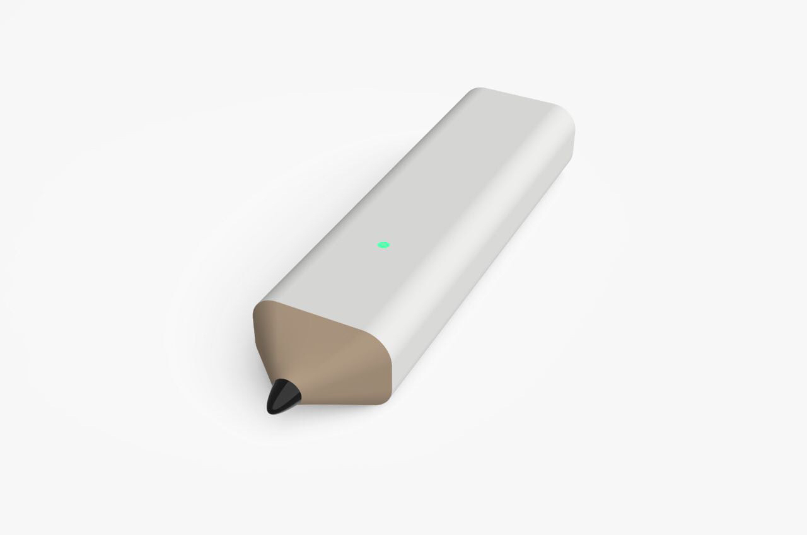
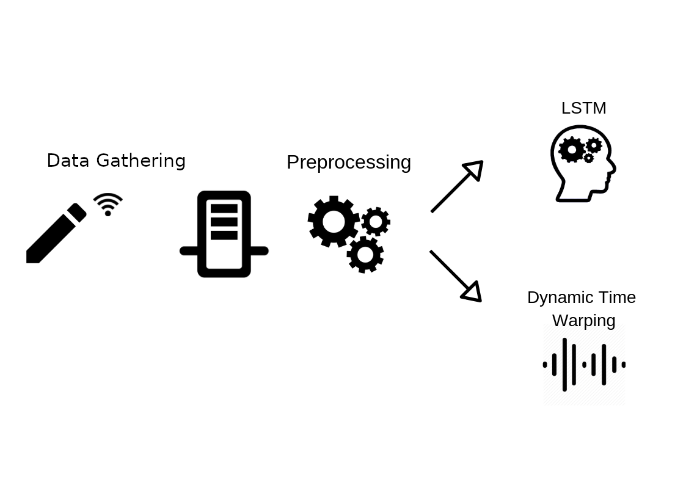
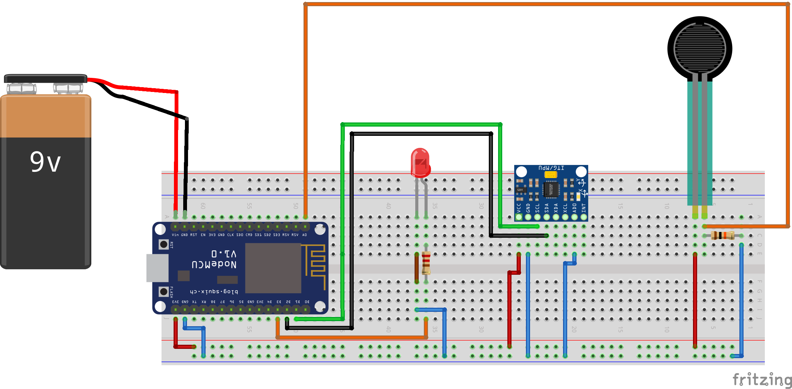

# PeterPen
The Peter's Pen is a project for handwriting recognition. We designed a pen with which we can capture data while a person
is writing, and then send it to a server through a Wi-Fi connection. The pen has been made
with affordable chips and its body with a 3D printer. Two recognition systems have been
implemented, one based on deep learning and the other on signal distances. On the available
dataset we have observed good performances from both systems, with very interesting findings
for the deep learning one. Full project Description can be found [here](report/EN/report.pdf).
There is an italian version [here](report/IT/report.pdf).
### Pen Design

### System Architecture
The system architecture is made out of 4 elements: the pen, a server which acquires data and the preprocessing and classification modules. The pen gathers data through its sensors and sends them to the server via a Wi-Fi module, which is installed on its chip. JSON files are used to store such data on the server (to each ”writing session”, i.e. the writing of a single word, a file is associated) and can thus be used by the pre-processing module. This last one has the objective of normalizing data, in order to make them usable by the classifiers. There are two classification modules, the first is a Neural Network which uses LSTMs, and the second one is based on the Dynamic Time Warping algorithm.

### Components and Circuit
- NODE MCU ESP8266 chip;
- [Accelerometer](https://www.amazon.it/Aukru-MPU-6050-Giroscopio-Accelerometro-Arduino/dp/B00PL70P7K/ref=sr_1_1?ie=UTF8&qid=1544976248&sr=8-1&keywords=accellerometro) and gyroscope
- Spring
- Tip
- pressure sensor
- printed casing
- Bluetooth
- a green LED
- a capacitor
- two resistors
- a 9V battery
- a PLA case

The ESP8266, the main chip, consists of a microcontroller and a Wi-Fi module used to communicate with the server. The accelerometer and the gyroscope (both on a single chip), the force sensor and the LED are connected to this chip. The sensor is able to measure the force applied on the pen tip thanks to a spring. Right after the force sensor there is the accelerometer and gyroscope chip and, after this, the ESP8266.

